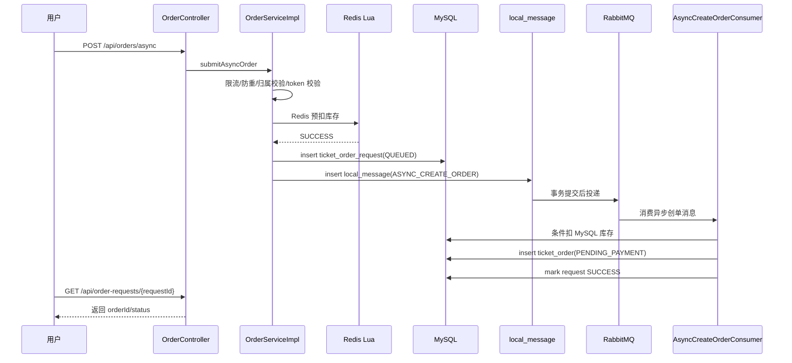

# SmartTicket Lite 系统流程阅读指南

这份文档用于帮助你按正确顺序阅读项目源码，先建立全局流程，再深入高并发抢票、异步下单、支付、超时关闭、补偿和后台治理。

## 先看结论

项目的主链路不是传统同步下单，而是：

```text
登录鉴权
  -> 获取/预取幂等 token
  -> 可选等待室入场 token
  -> 提交异步下单
  -> 多维限流 + 防重复提交 + soldout 快速失败
  -> Redis Lua 原子预扣库存
  -> ticket_order_request 记录请求状态
  -> local_message Outbox 记录待发送消息
  -> 定时任务投递 RabbitMQ
  -> RabbitMQ 消费者创建正式订单
  -> 用户查询 requestId 得到订单结果
  -> 创建支付单并模拟支付回调
  -> 支付成功确认库存，超时/取消释放库存
```

最重要的阅读原则：不要从所有 controller 一口气看起。先看下单主链路，再看可靠消息和补偿，最后看后台、库存治理、观测指标。

## 推荐阅读顺序

### 第 0 步：先建立项目边界

先读：

1. `README.md`
2. `src/main/resources/application.yml`
3. `src/main/java/com/zewbby/smartticket/constant/RedisKeyConstant.java`
4. `src/main/java/com/zewbby/smartticket/constant/RabbitMqConstant.java`

你要理解：

- 服务端口、profile、MySQL、Redis、RabbitMQ、Actuator 暴露范围。
- `smart-ticket.*` 下的业务配置：限流、Outbox、MQ 消费者、库存分桶、等待室、支付签名。
- Redis key 的命名边界：库存、幂等 token、等待室 token、限流、soldout、预扣记录。
- RabbitMQ exchange、queue、routing key 的命名，尤其异步下单队列分片。

读完这一组，你应该知道系统依赖什么中间件，以及每类业务状态大概落在哪里。

### 第 1 步：先看 HTTP 入口

先读：

1. `src/main/java/com/zewbby/smartticket/controller/AuthController.java`
2. `src/main/java/com/zewbby/smartticket/controller/OrderController.java`
3. `src/main/java/com/zewbby/smartticket/controller/PaymentController.java`
4. `src/main/java/com/zewbby/smartticket/controller/ShowController.java`

重点看 `OrderController`：

- `GET /api/orders/idempotency-token`：生成单个下单幂等 token。
- `GET /api/orders/idempotency-tokens`：批量预取幂等 token，用于抢票页提前准备。
- `GET /api/waiting-room/admission-token`：等待室入场资格，默认配置关闭校验。
- `POST /api/orders/async`：高并发抢票主入口。
- `GET /api/order-requests/{requestId}`：查询异步下单结果。
- `POST /api/orders`：旧同步下单入口，已废弃，只保留调试/兼容。

读这一组时只需要记住接口如何进来，不要急着追 mapper。

### 第 2 步：看鉴权和用户身份来源

先读：

1. `src/main/java/com/zewbby/smartticket/auth/JwtAuthenticationInterceptor.java`
2. `src/main/java/com/zewbby/smartticket/auth/UserContext.java`
3. `src/main/java/com/zewbby/smartticket/service/impl/AuthServiceImpl.java`
4. `src/main/java/com/zewbby/smartticket/auth/TokenBlacklistService.java`

你要理解：

- 用户身份来自 JWT 解析后的 `UserContext`。
- 下单请求里的 `userId` 字段不可信，只做历史兼容。
- 退出登录通过 Redis token 黑名单实现。
- 后台接口还会经过角色权限拦截。

这一步非常关键，因为订单、支付、查询都必须以当前登录用户为准。

### 第 3 步：看异步下单入口主流程

先读：

1. `src/main/java/com/zewbby/smartticket/service/impl/OrderServiceImpl.java`
2. 方法：`submitAsyncOrder(CreateOrderRequest request, String clientIp)`
3. DTO：`src/main/java/com/zewbby/smartticket/domain/dto/CreateOrderRequest.java`
4. VO：`src/main/java/com/zewbby/smartticket/domain/vo/OrderRequestVO.java`
5. 状态枚举：`src/main/java/com/zewbby/smartticket/enums/OrderRequestStatusEnum.java`

这段代码是抢票主链路，建议逐行看。它按这个顺序执行：

1. 从 `UserContext` 获取当前用户。
2. 做粗粒度下单限流。
3. 检查 soldout 标记，已售罄则快速失败。
4. 通过 `OrderSubmitGuard` 防止同一用户同票档重复提交。
5. 查询用户是否存在。
6. 校验 show、session、ticketCategory 三者归属关系。
7. 做票档维度限流。
8. 如果开启等待室，消费一次性 `admissionToken`。
9. 消费一次性幂等 token。
10. 生成稳定 `requestId`。
11. Redis Lua 原子预扣库存。
12. 创建 `ticket_order_request`，首次入库就是 `QUEUED`。
13. 创建 `ASYNC_CREATE_ORDER` 本地消息，写入 `local_message`。
14. 事务提交后触发消息投递任务。
15. 返回 `requestId` 给用户。

这一段体现了项目的核心思想：接口线程不创建正式订单，只拿资格、预扣 Redis、写请求状态和可靠消息。

### 第 4 步：看限流、防重复、等待室

先读：

1. `src/main/java/com/zewbby/smartticket/ratelimit/RateLimitService.java`
2. `src/main/resources/lua/rate_limit_token_bucket.lua`
3. `src/main/java/com/zewbby/smartticket/cache/OrderSubmitGuard.java`
4. `src/main/java/com/zewbby/smartticket/idempotency/IdempotencyTokenService.java`
5. `src/main/resources/lua/idempotency_token_consume.lua`
6. `src/main/java/com/zewbby/smartticket/service/WaitingRoomService.java`
7. `src/main/java/com/zewbby/smartticket/config/RateLimitProperties.java`
8. `src/main/java/com/zewbby/smartticket/config/WaitingRoomProperties.java`

你要理解这些防线各自负责什么：

| 防线 | 作用 | 失败时效果 |
|---|---|---|
| 粗粒度限流 | 按用户、IP、API 限制入口洪峰 | 直接拒绝，不查库存 |
| 票档限流 | 保护热点票档库存 key 和 MQ 链路 | 直接拒绝 |
| `OrderSubmitGuard` | 同一用户同一票档短时间只允许一次处理中请求 | 防重复点击 |
| 幂等 token | 确保一次下单请求只消费一次 | 防重放 |
| 等待室 token | 热门活动先发入场资格，再允许下单 | 把无资格流量挡在库存链路前 |
| soldout 快速失败 | 最近 Redis 判断无库存后直接拒绝 | 不写 request、不写 Outbox、不进 MQ |

这组文件解释了为什么系统不是所有流量都直接冲 MySQL。

### 第 5 步：看 Redis 库存预扣

先读：

1. `src/main/java/com/zewbby/smartticket/service/StockLuaService.java`
2. `src/main/resources/lua/stock_pre_deduct.lua`
3. `src/main/resources/lua/stock_pre_deduct_bucket.lua`
4. `src/main/resources/lua/stock_rollback.lua`
5. `src/main/java/com/zewbby/smartticket/service/BucketRouteService.java`
6. `src/main/java/com/zewbby/smartticket/config/StockBucketProperties.java`
7. `src/main/java/com/zewbby/smartticket/service/StockCacheService.java`

你要理解：

- Redis 是入口阶段的抢票资格判断，不是最终订单事实。
- `requestId` 会参与预扣记录，避免同一请求重复扣库存。
- 分桶库存通过多个 Redis bucket 分散热点票档压力。
- Redis 扣成功后，MySQL 消费者仍要再次做条件扣减，防止最终超卖。
- 失败补偿通过带 `requestId` 的释放脚本完成，避免重复释放把库存加多。

建议结合 `OrderServiceImpl.preDeductRedisStock` 一起看。

### 第 6 步：看 ticket_order_request 状态机

先读：

1. `src/main/java/com/zewbby/smartticket/domain/entity/TicketOrderRequest.java`
2. `src/main/java/com/zewbby/smartticket/mapper/OrderRequestMapper.java`
3. `src/main/resources/mapper/OrderRequestMapper.xml`
4. `src/main/java/com/zewbby/smartticket/enums/OrderRequestStatusEnum.java`
5. `src/main/java/com/zewbby/smartticket/enums/CompensationStatusEnum.java`

核心状态含义：

| 状态 | 含义 |
|---|---|
| `QUEUED` | 已预扣 Redis，已写请求记录，等待消费者处理 |
| `PROCESSING` | 消费者拿到消息，正在创建正式订单 |
| `SUCCESS` | 正式订单创建成功 |
| `FAILED` | 创建订单失败或业务校验失败 |
| `COMPENSATED` | 失败后 Redis 预扣库存已补偿 |

现在主链路已经不再先插入 `PRE_DEDUCTED` 再 update `QUEUED`，而是首次插入就带 `QUEUED` 和 `messageId`，减少一次数据库写。

### 第 7 步：看 Outbox 可靠消息

先读：

1. `src/main/java/com/zewbby/smartticket/service/AsyncOrderMessagePublisher.java`
2. `src/main/java/com/zewbby/smartticket/service/impl/LocalMessageAsyncOrderMessagePublisher.java`
3. `src/main/java/com/zewbby/smartticket/service/LocalMessageService.java`
4. `src/main/java/com/zewbby/smartticket/service/impl/LocalMessageServiceImpl.java`
5. `src/main/java/com/zewbby/smartticket/domain/entity/LocalMessage.java`
6. `src/main/java/com/zewbby/smartticket/enums/LocalMessageStatusEnum.java`
7. `src/main/java/com/zewbby/smartticket/task/LocalMessagePublishTask.java`
8. `src/main/java/com/zewbby/smartticket/mq/RabbitPublisherCallbackHandler.java`

你要理解 Outbox 的可靠性模型：

1. 业务事务内写 `local_message`。
2. 事务提交后触发发送。
3. 定时任务扫描 `INIT`、`FAILED` 等可发送消息。
4. 发送前通过条件更新抢占 `SENDING`，防止多实例重复发。
5. RabbitTemplate 发送后进入 `SENT`。
6. Publisher Confirm 成功后进入确认状态。
7. 失败、Return、Confirm 超时会进入重试或 DEAD。

这部分解决的是“数据库事务成功但 MQ 发送失败”的一致性问题。代价是多了一张消息表和额外 DB 写入，所以它可靠但不是百万级主事件日志的终局形态。

### 第 8 步：看 RabbitMQ 配置和分片消费

先读：

1. `src/main/java/com/zewbby/smartticket/config/RabbitMqConfig.java`
2. `src/main/java/com/zewbby/smartticket/config/MqConsumerProperties.java`
3. `src/main/java/com/zewbby/smartticket/constant/RabbitMqConstant.java`
4. `src/main/java/com/zewbby/smartticket/mq/AsyncCreateOrderConsumer.java`
5. `src/main/java/com/zewbby/smartticket/mq/DeadLetterMessageRecoverer.java`
6. `src/main/java/com/zewbby/smartticket/service/impl/DeadLetterMessageServiceImpl.java`

重点：

- 默认异步下单队列分片数为 16。
- `LocalMessageServiceImpl` 会按 `ticketCategoryId` 路由到不同 shard routing key。
- `AsyncCreateOrderConsumer` 监听 `orderAsyncQueueNames`，可同时消费多个分片队列。
- 消费者本地有限重试，重试耗尽后写 `dead_letter_message`，而不是无限重回队列。
- RabbitMQ 仍是业务可靠消息组件，不是百万级活动事件日志组件；大活动主链路建议 Kafka/RocketMQ。

### 第 9 步：看消费者如何创建正式订单

先读：

1. `src/main/java/com/zewbby/smartticket/mq/AsyncCreateOrderConsumer.java`
2. `src/main/java/com/zewbby/smartticket/domain/entity/TicketOrder.java`
3. `src/main/java/com/zewbby/smartticket/mapper/OrderMapper.java`
4. `src/main/resources/mapper/OrderMapper.xml`
5. `src/main/java/com/zewbby/smartticket/mapper/TicketStockMapper.java`
6. `src/main/resources/mapper/TicketStockMapper.xml`
7. `src/main/java/com/zewbby/smartticket/mapper/TicketStockBucketMapper.java`
8. `src/main/resources/mapper/TicketStockBucketMapper.xml`

消费者主流程：

1. 根据 `requestId` 查询 `ticket_order_request`。
2. 如果请求已成功或终态，直接跳过，保证幂等。
3. 抢占状态为 `PROCESSING`。
4. 校验演出、场次、票档关系。
5. MySQL 条件扣库存或扣分桶库存。
6. 创建 `ticket_order` 正式订单，状态为 `PENDING_PAYMENT`。
7. 写订单快照：演出名、场次、票档名、价格、总金额。
8. 标记请求 `SUCCESS` 并关联 `orderId`。
9. 创建订单超时关闭消息。

这里是“最终库存事实”的地方。Redis 入口预扣只是第一道门，MySQL 条件扣减才是正式订单落库保护。

### 第 10 步：看支付流程

先读：

1. `src/main/java/com/zewbby/smartticket/controller/PaymentController.java`
2. `src/main/java/com/zewbby/smartticket/service/PaymentService.java`
3. `src/main/java/com/zewbby/smartticket/service/impl/PaymentServiceImpl.java`
4. `src/main/java/com/zewbby/smartticket/service/PaymentSignatureService.java`
5. `src/main/java/com/zewbby/smartticket/service/PaymentAuditService.java`
6. `src/main/java/com/zewbby/smartticket/service/impl/PaymentAuditServiceImpl.java`
7. `src/main/java/com/zewbby/smartticket/domain/entity/PaymentOrder.java`
8. `src/main/java/com/zewbby/smartticket/domain/entity/PaymentCallbackLog.java`
9. `src/main/java/com/zewbby/smartticket/domain/entity/PaymentFlowLog.java`

你要理解：

- 支付单和订单分离。
- mock 支付回调必须有签名、timestamp、nonce。
- 回调会记录原始日志和状态流转。
- 支付成功后订单从 `PENDING_PAYMENT` 变为 `PAID`。
- 支付成功后库存会从 locked/sold 方向确认，具体看 mapper 的更新语句。

### 第 11 步：看取消和超时关闭

先读：

1. `src/main/java/com/zewbby/smartticket/service/impl/OrderServiceImpl.java`
2. 方法：`cancelOrder`
3. 方法：`closeTimeoutOrder`
4. `src/main/java/com/zewbby/smartticket/mq/OrderTimeoutProducer.java`
5. `src/main/java/com/zewbby/smartticket/mq/OrderTimeoutConsumer.java`
6. `src/main/java/com/zewbby/smartticket/task/OrderTimeoutScanTask.java`
7. `src/main/java/com/zewbby/smartticket/config/OrderTimeoutProperties.java`

你要理解：

- 正式订单创建后处于 `PENDING_PAYMENT`。
- 用户主动取消会释放 MySQL 库存，并关闭支付单。
- 订单超时关闭有两层保障：延迟消息和定时扫描。
- 如果订单已经 `PAID`、`CANCELLED`、`CLOSED`，超时关闭会跳过。
- 异步订单取消/关闭时，还要关注 Redis 预扣释放和分桶库存回滚。

### 第 12 步：看库存一致性和补偿治理

先读：

1. `src/main/java/com/zewbby/smartticket/service/StockConsistencyService.java`
2. `src/main/java/com/zewbby/smartticket/service/impl/StockConsistencyServiceImpl.java`
3. `src/main/java/com/zewbby/smartticket/task/StockConsistencyScanTask.java`
4. `src/main/java/com/zewbby/smartticket/service/StockAdjustmentService.java`
5. `src/main/java/com/zewbby/smartticket/service/impl/StockAdjustmentServiceImpl.java`
6. `src/main/java/com/zewbby/smartticket/service/StockBucketPorterService.java`
7. `src/main/java/com/zewbby/smartticket/service/impl/StockBucketPorterServiceImpl.java`
8. `src/main/java/com/zewbby/smartticket/task/StockBucketPorterTask.java`

这组用于后台治理：

- Redis/MySQL 库存差异扫描。
- 修复 Redis 库存时考虑在途预扣量。
- 人工库存调整需要记录审计。
- 分桶库存迁移由 porter 任务处理，避免活动中切桶造成库存丢失。

### 第 13 步：看后台和运维接口

先读：

1. `src/main/java/com/zewbby/smartticket/controller/AdminBusinessController.java`
2. `src/main/java/com/zewbby/smartticket/controller/AdminStockController.java`
3. `src/main/java/com/zewbby/smartticket/controller/AdminStockAdjustmentController.java`
4. `src/main/java/com/zewbby/smartticket/controller/AdminLocalMessageController.java`
5. `src/main/java/com/zewbby/smartticket/controller/AdminDeadLetterMessageController.java`
6. `src/main/java/com/zewbby/smartticket/controller/AdminOpsMetricsController.java`
7. `src/main/java/com/zewbby/smartticket/service/impl/AdminOperationLogServiceImpl.java`

你要理解：

- 后台资源有 `DRAFT/PUBLISHED/OFFLINE` 状态。
- 用户侧只能看到已发布资源。
- 后台可以查看/重试本地消息、处理死信、做库存检查和修复。
- 高风险后台动作写入 `admin_operation_log`。
- 普通 `USER` 不能访问 `/api/admin/**`。

### 第 14 步：看观测指标

先读：

1. `src/main/java/com/zewbby/smartticket/service/ObservabilityMetricsService.java`
2. `src/main/java/com/zewbby/smartticket/service/impl/ObservabilityMetricsServiceImpl.java`
3. `src/main/java/com/zewbby/smartticket/controller/AdminOpsMetricsController.java`
4. `src/main/resources/application.yml` 的 `management` 配置

重点指标：

- 下单请求数、异步请求成功/失败。
- 限流拒绝数。
- soldout 快速失败。
- local_message DEAD。
- dead_letter_message PENDING。
- 库存一致性待处理和补偿失败。

这一步用于判断系统是否健康，而不是理解业务主流程的第一入口。

## 四条最重要的业务流程

### 流程一：异步抢票成功



### 流程二：Redis 预扣失败

```text
POST /api/orders/async
  -> 限流/防重/归属/token 检查通过
  -> Redis Lua 返回 STOCK_NOT_ENOUGH 或 SOLD_OUT
  -> 直接抛业务异常
  -> 不创建 ticket_order_request
  -> 不写 local_message
  -> 不进入 RabbitMQ
```

这个流程非常重要，因为它避免了无库存请求继续打 MySQL。

### 流程三：消费者创建订单失败后的补偿

```text
AsyncCreateOrderConsumer 收到消息
  -> request 抢占 PROCESSING
  -> MySQL 扣库存失败或业务校验失败
  -> request 标记 FAILED
  -> 调 Redis release 脚本释放预扣
  -> 成功则标记补偿完成
  -> 重试耗尽或异常进入 dead_letter_message
```

这里要重点看 `AsyncCreateOrderConsumer` 的异常分类和补偿逻辑。

### 流程四：待支付订单关闭

```text
订单创建成功 PENDING_PAYMENT
  -> 写订单超时关闭本地消息
  -> RabbitMQ 延迟/死信或定时扫描触发 closeTimeoutOrder
  -> 如果订单仍是 PENDING_PAYMENT
  -> 更新为 CLOSED
  -> 释放 MySQL locked_stock
  -> 关闭支付单
  -> 释放关联异步请求的 Redis 预扣记录
```

支付成功后，超时关闭会跳过，不会重复释放库存。

## 数据表按阅读优先级

优先看这些实体和 mapper：

1. `TicketOrderRequest`：异步请求状态机。
2. `LocalMessage`：Outbox 可靠消息。
3. `TicketOrder`：正式订单。
4. `TicketStock` / `TicketStockBucket`：持久库存和分桶库存。
5. `PaymentOrder`：支付单。
6. `DeadLetterMessage`：消费者失败治理。
7. `StockConsistencyRecord` / `StockCompensationRecord`：库存巡检和补偿。
8. `AdminOperationLog`：后台审计。

对应目录：

- `src/main/java/com/zewbby/smartticket/domain/entity`
- `src/main/java/com/zewbby/smartticket/mapper`
- `src/main/resources/mapper`

如果本地存在 `docs/sql/schema.sql`，建议最后再看 SQL 建表；如果该文件缺失，就先以 entity 和 mapper XML 为准。

## HTTP 调试文件阅读顺序

建议按这个顺序看 `docs/api`：

1. `docs/api/phase1-auth-api.http`
2. `docs/api/show.http`
3. `docs/api/phase4-idempotency-token-api.http`
4. `docs/api/async-order-submit-api.http`
5. `docs/api/async-order-result-api.http`
6. `docs/api/phase3-async-order-full-flow.http`
7. `docs/api/phase5-redis-stock-api.http`
8. `docs/api/phase5-reliable-message-api.http`
9. `docs/api/phase2-consumer-dlq-api.http`
10. `docs/api/phase1-payment-api.http`
11. `docs/api/order-timeout-api.http`
12. `docs/api/phase2-stock-consistency-api.http`

如果你只想先跑通主链路，读 1 到 6 就够了。

## 读代码时的检查问题

每读完一个模块，建议用这些问题自测：

1. 这个模块挡住的是哪类风险：重复提交、超卖、消息丢失、支付伪造、库存不一致，还是后台误操作？
2. 失败时状态落在哪里：Redis、MySQL request、local_message、dead_letter_message，还是日志？
3. 这个模块是入口保护、最终事实、异步可靠性，还是后台补偿？
4. 是否会增加数据库写放大？
5. 热门活动时这个模块能否按活动/票档隔离？

这些问题比单纯背接口更有用。

## 当前系统的关键优点

1. 下单主链路已经异步化，接口线程不创建正式订单。
2. Redis Lua 预扣把无库存请求挡在 MySQL 前。
3. 幂等 token、重复提交 guard、限流和 soldout 形成多层入口防线。
4. Outbox 保障业务写库和消息发送意图的一致性。
5. 消费者有幂等状态机、有限重试、死信落库和人工治理入口。
6. 支付回调有签名、nonce、日志和状态流转。
7. 库存有巡检、修复、补偿记录。
8. 最近已加入批量 token、默认队列分片、等待室入场资格开关。

## 当前系统仍要清醒认识的限制

1. `local_message` 仍然是数据库写放大，可靠但不适合百万级主事件日志峰值。
2. RabbitMQ 分片能缓解单队列瓶颈，但不能替代 Kafka/RocketMQ 这类高吞吐日志系统。
3. 等待室现在只是入场资格开关，还不是完整活动隔离体系。
4. 活动级独立 Redis keyspace、MQ topic、消费者组、数据库分区还没有完全落地。
5. 压测时必须区分“token 预取吞吐”和“下单提交吞吐”，不能混在一起看。

## 文档自检结果

我按下面标准检查了本文档：

| 检查项 | 结果 |
|---|---|
| 是否先给出全局主链路 | 通过，开头已经用文本链路概括完整流程 |
| 是否给出明确阅读顺序 | 通过，按第 0 步到第 14 步组织 |
| 是否点名具体文件 | 通过，覆盖 controller、service、mapper、lua、config、task、mq |
| 是否覆盖正常链路 | 通过，包含异步抢票成功流程 |
| 是否覆盖失败和补偿链路 | 通过，包含 Redis 预扣失败、消费者失败补偿、超时关闭 |
| 是否解释关键技术 | 通过，解释 JWT、限流、幂等、等待室、Redis Lua、Outbox、RabbitMQ、支付签名 |
| 是否指出当前限制 | 通过，单独列出数据库写放大、RabbitMQ 上限、活动隔离不足 |
| 是否适合新读者 | 通过，提供 30 分钟最短阅读路径 |

## 最短阅读路径

如果你只有 30 分钟，按这个顺序看：

1. `OrderController`
2. `OrderServiceImpl.submitAsyncOrder`
3. `StockLuaService` 和库存 Lua
4. `LocalMessageServiceImpl`
5. `LocalMessagePublishTask`
6. `RabbitMqConfig`
7. `AsyncCreateOrderConsumer`
8. `PaymentServiceImpl`
9. `OrderServiceImpl.closeTimeoutOrder`

看完这 9 个点，你就能讲清楚系统从用户点击抢票到订单创建、支付、超时关闭的完整闭环。

## 一句话总览

SmartTicket Lite 的核心不是“下单接口直接扣库”，而是“入口限流和 Redis 预扣拿资格，Outbox 可靠投递异步创单消息，消费者最终扣 MySQL 并创建订单，支付和超时关闭完成库存闭环，后台治理负责异常补偿”。
